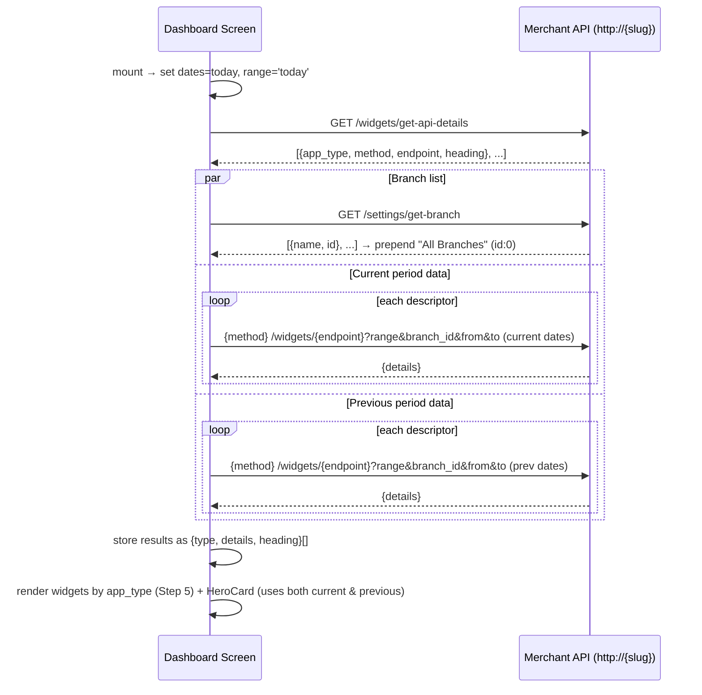

# POS Dashboard — Implementation Guide

This is a build guide for reimplementing the **POS Dashboard** screen (old app route name `dashpos`) in a new codebase: the login/session it depends on, the API calls it makes, the filters it exposes, and exactly how each widget maps API data to UI. It's written in build order — follow the steps top to bottom and you'll end up with the same feature, minus the pitfalls called out in Step 7.

Every fact below was extracted directly from the old app's source (`components/views/POS/*.js`, `components/views/Login.js`, `components/services/interceptores.js`, `components/utils/constants.js`) and cross-checked by re-reading the two most central files (`Dashbord.js`, `Login.js`) end-to-end. Endpoint paths, param names, and response field names are quoted verbatim — treat them as the contract to reproduce, not paraphrases.

## Build order checklist

- **Step 0** — Scope: what "POS Dashboard" is, and two same-named things it is *not*.
- **Step 1** — Login/session bootstrap: get a token and a merchant host stored.
- **Step 2** — Base-URL + auth pattern: how every request is addressed and authenticated.
- **Step 3** — Fetch sequence: the 3-endpoint dance that loads the screen.
- **Step 4** — Filters: date range, branch, tabs, pull-to-refresh.
- **Step 5** — Widget dispatch: routing fetched data to the right widget by type.
- **Step 6** — Widgets: build each of the 8 widgets with exact data mapping.
- **Step 7** — Pitfalls: old-app quirks to consciously replicate or fix.
- **Appendix** — AsyncStorage key reference + old-repo file map.

---

## Step 0 — Scope & disambiguation

You're rebuilding one screen and its widget tree: the POS Dashboard (Overview + Branches tabs, date/branch filters, 8 widget types). Two other things in the old repo share the word "Dashboard" but are **not** this feature — don't mine them for requirements:

- The old Login screen's segmented toggle labels this mode **"Dashboard"** (icon: point-of-sale) as opposed to **"Operations"**. That's just this feature's login entry point (Step 1) — not a separate screen.
- `components/views/Settings/Dashboard.js` is a completely unrelated legacy screen reached from the *Operations* side's Settings menu (route name `"dashboard"`, lowercase — different route from `"dashpos"`). It shows three numbers and a flat branch list via a totally different endpoint (`GET {ops_base_url}/getstats?json=1`) and a totally different auth mechanism (Redux + a mutable `INDOLJ_URL`). No shared code, no shared state with the POS Dashboard. Ignore it.

**Architectural note that should shape your new implementation:** the old POS Dashboard is 100% local component state (`useState`/`useRef`) plus direct HTTP calls — it never touches Redux and never touches the old app's shared `productAction.js` action layer. It's a self-contained feature that only needs a token + a merchant host string to run. Build it the same way: don't wire it into a global store unless your new app's architecture specifically calls for it.

---

## Step 1 — Implement the login/session bootstrap

The dashboard can't run without three things in storage: a **merchant host**, a **bearer token**, and **user info**. Here's exactly how the old app obtains and stores them, so you can reproduce (or deliberately improve) the flow.

### The login call

```
POST http://{merchantHostTyped}/auth/login
Content-Type: application/json

{
  "email": "...",
  "password": "...",
  "is_hash": 0,
  "remember_me": true|false,
  "install_check_reload": false,
  "install_no": false
}
```

- `{merchantHostTyped}` is raw user input from a "Merchant Name" text field (placeholder in the old app: `e.g. yourstore.indolj.pk`), trimmed of whitespace. There's no directory/lookup step — the user must know and type their own host. Decide in your rewrite whether you want to keep this as free text or replace it with something safer (a slug→host lookup, a QR code, a saved-merchants list, etc.) — the old app takes the trust-the-user approach.
- Note the call is **plain `http://`, not `https://`**. Decide deliberately whether to keep this or upgrade to TLS.

### Handling the response

The old app's response contract is positional/array-shaped, not an object:

```js
response.data[0].access_token   // → store as the bearer token
response.data[1]                // → store as "userInfo" (only `.name` is ever read back out of it)
```

After a successful call, persist:

| What | Old key name | Value |
|---|---|---|
| Merchant host | `slug` | the trimmed merchant-name string the user typed, JSON-stringified |
| Bearer token | `token` | `response.data[0].access_token`, raw string |
| User info | `userInfo` | `JSON.stringify(response.data[1])` |
| Remember-me flag | `isRemeber` | the checkbox state, JSON-stringified |
| Session-type flag | `pos` | `JSON.stringify(true)` — used elsewhere to distinguish this login flow from the unrelated Operations login |

Then navigate to the dashboard screen.

### Error handling to reuse (or replace with your own copy)

| Condition | Old app's message |
|---|---|
| HTTP 401 | "Invalid Email or Password" |
| HTTP 422 | "Invalid Email Please Enter Correct One" |
| Request sent but no response (network/DNS failure — i.e. bad merchant host) | "Invalid Merchant Name or Network Error" |
| Anything else | "Something Went Wrong" |

Client-side validation before submit: require email, password, and a non-empty (trimmed) merchant name; otherwise show "Please Enter Valid Crediental" and don't submit.

**End state:** you have `slug` (host), `token` (bearer), `userInfo` (for display name) in storage, and you've navigated to the dashboard screen. Everything from here on reads those three values.

---

## Step 2 — Implement the base-URL + auth pattern

Every dashboard API call — including every widget fetch — is addressed and authenticated the same simple way. Implement this once as a small helper, then reuse it for every call in Step 3.

### Host construction

```
http://{slug}/{path}
```

`slug` is exactly the string stored in Step 1 (the merchant host the user typed at login) — read fresh from storage before building the URL, not cached in a long-lived variable, since the old app re-reads it on every fetch cycle. This is intentionally **per-merchant** — there is no single fixed API host for this feature. (This is a different mechanism from the old app's other login flow, which uses a fixed, centrally-mutable base URL — don't conflate the two if you're reading the old repo further; the POS Dashboard never touches that other mechanism.)

### Auth header

Every request manually sets:

```
Authorization: Bearer {token}
```

where `token` is read fresh from storage (same re-read-every-time pattern as `slug`).

### A gotcha worth deciding on purpose

The old app also has a **global axios interceptor** (unrelated to this feature, registered app-wide) that unconditionally overwrites `Authorization` with a *different* stored token (`accessToken`) whenever that key happens to be present — and that key is only ever populated by the old app's *other*, unrelated login flow. On a device that had ever used both flows, the dashboard's own manually-set header could get silently clobbered by a stale, unrelated token. If your new app has any shared/global HTTP client interceptor, make sure it can't do this — scope any global auth-header injection to the login flow it belongs to, or don't apply one at all to this feature's HTTP client.

**End state:** a `fetchDashboard(path, params)`-style helper that reads `slug`+`token` from storage, builds `http://{slug}/{path}`, and sets the bearer header — ready to use for every call below.

---

## Step 3 — Implement the fetch sequence

This is the core data-loading logic, triggered on screen mount and again on every filter change / pull-to-refresh (Step 4 wires up the triggers; this step is just the sequence itself).

### 3.1 — Discover the widgets

```
GET http://{slug}/widgets/get-api-details
Authorization: Bearer {token}
```

Response: `res.data.details` → an array of **widget descriptors**, each shaped:

```ts
{ app_type: string, method: "get"|"post"|..., endpoint: string, heading?: string }
```

This array is the config that drives everything else — how many widgets to fetch, what HTTP method/path each uses, and (via `app_type`) which UI component renders it (Step 5).

### 3.2 — Fan out to two more calls, in parallel

Once you have the descriptor array, fire off (a) the branch list and (b) one data call per descriptor — and do it **twice**, once for the current date range and once for a computed "previous period" (needed for the trend arrows in Step 6's HeroCard). Structure it as:

```
Promise.all([
  Promise.all(descriptors.map(d => fetchWidgetData(d, currentFrom, currentTo))),
  Promise.all(descriptors.map(d => fetchWidgetData(d, prevFrom,    prevTo))),
])
```

plus, independently:

```
GET http://{slug}/settings/get-branch
Authorization: Bearer {token}
```
→ `res.data[0].data` (note the shape: an array, whose first element holds the real payload in `.data`) → the branch list. Prepend a synthetic **"All Branches"** entry with `id: 0` — the rest of the UI (branch dropdown, "All Branches" = no filter) depends on this sentinel existing.

### 3.3 — The per-widget data call

```
GET|POST http://{slug}/widgets/{descriptor.endpoint}     // method per descriptor.method
Authorization: Bearer {token}
?range={'24' if descriptor.app_type === 'chartbar' else '12'}
&branch_id={selected branch id, or omitted entirely for "All Branches"}
&from={YYYY-MM-DD}
&to={YYYY-MM-DD}
```

Response: `res.data.details` — shape depends on `app_type` (see Step 6 per widget). Wrap the result as you go so downstream code can route by type:

```ts
{ type: descriptor.app_type, details: res.data.details, heading: descriptor.heading }
```

Note `heading` comes from the **request-config descriptor**, not from the response body.

On failure, the old app just drops that one widget's result (logs and continues) rather than failing the whole screen — decide in Step 7 whether you want the same "degrade gracefully, no user-facing error" behavior or something more visible.

### 3.4 — The "previous period" calculation

Reproduce this exactly — it's a precise algorithm, easy to get subtly wrong:

| Current range | Previous period |
|---|---|
| Today | Yesterday (single day) |
| Yesterday | The day before yesterday (single day) |
| This Week | The prior ISO week (Mon–Sun), full week |
| This Month | The prior calendar month, full month |
| Custom (`start`…`end`) | Same span length, shifted to end the day immediately before `start`. I.e. `prevTo = start - 1 day`; `prevFrom = prevTo - (end - start) days` |

### 3.5 — End-to-end sequence diagram



**End state:** on mount (and on every filter change / refresh), the screen ends up with a current-period result array, a previous-period result array, and a branch list, all in local state, ready for Step 5 to route into widgets.

---

## Step 4 — Implement the filters

Build four independent controls. Each one either re-runs Step 3's sequence immediately or requires an explicit "Apply" — get this right per-control, it's not uniform.

### 4.1 — Quick date-range picker

A bottom sheet / dropdown with 5 options: **Today, Yesterday, This Week, This Month, Custom**.

- Selecting **Today / Yesterday / This Week / This Month**: compute the concrete `from`/`to` dates immediately (today; yesterday; ISO-week-start→today; month-start→today, respectively) and **re-run the fetch sequence right away** — no separate confirm step.
- Selecting **Custom**: just switch the UI into "custom mode" (reveal two date pickers) — **do not fetch yet**.

### 4.2 — Custom From/To pickers (visible only in Custom mode)

- Picking a date in either picker only updates local state — **still no fetch**.
- An explicit **Apply** button validates (both dates chosen; `from ≤ to`, else show a validation message — old copy: *"Please select both dates"* / *"End date can't be before start date"*) and then runs the fetch sequence.
- An explicit **Clear** button resets to All Branches + Today + range=Today and fetches immediately.

### 4.3 — Branch selector

A dropdown/bottom-sheet populated from the branch list (Step 3.2), including the "All Branches" (`id: 0`) sentinel. Selecting a branch:
- Normalizes `id === 0` to "no branch filter" (omit `branch_id` from requests) — everything else passes the real id straight through.
- **Fires the fetch immediately**, no Apply step.
- **Important scope limit to preserve or consciously change:** this selector only affects the single-branch Overview-tab fetch. It has no effect on the Branches tab (4.4) — that tab always shows every branch regardless of what's selected here. If you want per-branch filtering in your Branches tab too, that's a deliberate improvement over the old app, not a bug you're missing.

### 4.4 — Overview / Branches tabs

Two simple tabs, no fetch triggered by the tab switch itself in Overview — but switching **into** the Branches tab should trigger that tab's own independent fetch: loop over every real branch (excluding the "All Branches" sentinel) × only the descriptors whose `app_type` is `salescard`, `orders`, or `chartbar` (skip `salestable`/`paymentcard`/`partycard` for this view), each with `range` fixed at `'12'` (note: the old app does *not* bump this to `'24'` for `chartbar` here the way the Overview fetch does — decide if that inconsistency matters for your rewrite). Re-run this fetch whenever the active date range changes while on this tab.

### 4.5 — Pull-to-refresh

On the Overview tab only: re-run Step 3's fetch sequence with whatever filters are currently active. No new logic — it's the same fetch, just re-triggered.

### 4.6 — Persistence (or lack thereof)

The old app does **not** persist filter selections — every fresh screen mount resets to Today / All Branches / Overview tab. Decide whether your rewrite should remember the user's last filter choice; that would be an improvement, not a requirement to match.

---

## Step 5 — Implement the `app_type` → widget dispatch

Once Step 3 gives you a `{type, details, heading}[]` array, route each entry to a widget by `type` (the descriptor's `app_type`):

| `app_type` | Renders as | What it's given |
|---|---|---|
| `salestable` or `salestable_wp` | A summary card with a "View" button that drills into a **full-screen table** (Step 6.7) | Navigate/route to the table screen, passing `{ data: item.details, heading: item.heading, type: item.type }` |
| `chartbar` | Bar chart widget (Step 6.2) | `item.details` |
| `salescard` | Metric-card grid widget (Step 6.4) | `item.details`, `item.heading` |
| `orders` | Counters + order-type breakdown widget (Step 6.3) | `item.details` |
| `paymentcard` | Payment-method donut widget (Step 6.5) | `item.details` |
| `partycard` | Per-party ring-gauge widget (Step 6.6) | `item.details` |

One more widget — the hero summary card (Step 6.1) — isn't tied to a single `app_type`. Render it unconditionally at the top of the Overview tab, and have it independently pull the `salescard`, `orders`, and `chartbar` entries back out of the *whole* result array itself (it needs all three to compute its combined totals). Feed it the full current-period array and the full previous-period array (for trend deltas), plus a human-readable label for the active date range.

Gate the sales-table "View" button on at least one `salestable`-typed fetch having succeeded — until then, treat it as not-yet-ready (disabled) rather than navigating to an empty table.

---

## Step 6 — Implement each widget

For every widget: the input shape it needs, the exact transform to reproduce, and the UI primitive it needs.

### 6.1 — Hero summary card

**Input:** the *entire* current-period result array, the *entire* previous-period result array (nullable), and a date-range label string.

**Build it like this:**
1. From the full array, pull out the `salescard` entry's `details` (an array of `{name, value}`), the `orders` entry's `details` (an object `{total: [{name,value}], donut: [...]}`), and the `chartbar` entry's `details` (an object `{total: [...], bar: {...}}`). Missing entries default to `[]`/`{}`.
2. Extract these fields from the `salescard` array by **case-insensitive substring match on `name`** (not exact keys — the API's naming is inconsistent enough that this fuzzy matching is load-bearing):
   - Gross total: first match among `"total collected"`, `"gross sale"`, `"gross"`, `"net sale inc tax"`, `"sale inc tax"`, `"net sale inc"`, `"total"` (in that priority order).
   - Discount: first match containing `"discount"`.
   - Tax: first match containing `"tax"`.
3. Order count: prefer the `orders` entry's `total` array (match on name containing `"order"`); if that widget didn't return data, fall back to the `chartbar` entry's `total` array (same name match) — the comment in the old code is explicit that the orders widget is authoritative and the chartbar fallback "may be 0" because it only reflects the visible hourly window.
4. Parse every extracted value string with a numeric parser that: strips everything except digits and `.`, then multiplies by 1,000,000 if the original string ended in `m`/`M`, or by 1,000 if it ended in `k`/`K`. (The API apparently sometimes returns abbreviated strings like `"1.2M"`.)
5. Average order value = gross ÷ order count (0 if order count is 0).
6. Trend % for each metric = `round((current - previous) / previous * 100)`, or "no trend shown" if the previous value is 0/falsy.
7. Currency symbol: extract the **leading non-numeric characters** of the raw gross/discount/tax string (regex idea: match everything before the first digit, minus sign, or decimal point) and use that as a prefix on formatted amounts. See Step 7 for a specific bug in the old app's version of this you should fix rather than copy.
8. Format large numbers abbreviated: ≥1,000,000 → `"{n/1e6:.1f}M"`, ≥10,000 → `"{n/1e3:.1f}K"`, else thousands-grouped with commas. Average order value uses 2 decimal places instead of 1 in the abbreviated forms.

**Render:** one large "Total Sales" figure + trend pill, plus 4 sub-tiles (Orders, Avg Order Value, Discount Amount, Sales Tax Amount), each with its own trend pill (green up-arrow / red down-arrow, based on sign).

### 6.2 — Bar chart widget

**Input:** `{ bar: { [key]: {name, value} }, total: [{name, value}] }` — note `bar` is an **object**, not an array; take `Object.values(bar)` to get the list of intervals.

**Build it like this:**
1. Filter to intervals with `value > 0`. If that leaves zero results (i.e. every interval is genuinely zero), fall back to showing all intervals anyway — otherwise a real all-zero period would render as a totally empty/broken-looking chart instead of a flat one.
2. Map each surviving interval to a bar: `{ value: parseFloat(item.value)||0, label: item.name }`.
3. Y-axis max = `max(tallest bar × 1.25, 1)` — 25% headroom, with a floor of 1 so an all-zero chart still renders a visible axis.
4. Separately render the `total` array as small KPI tiles above the chart — one tile per entry, currency-prefixed for every entry except one named `"Total Orders"` (that one's a plain count).
5. Chart style to match: 3D-look bars with a gradient fill and a shaded right side, ~12px wide, 4 grid sections, tap/hover tooltip showing the raw value.

### 6.3 — Order insights widget

**Input:** `{ total: [{name, value}], donut: [{name, value}] }`.

**Build it like this:**
1. `total` entries are simple counters — match by name against a small config table (Total Customer(s), Total Order(s)) to pick an icon/color per tile; render the raw value.
2. `donut` entries are **raw order counts per order-type**, not pre-computed percentages — despite the field name, compute the percentage yourself: `pct = round(count / sum(all donut counts) * 100)`.
3. Match each entry's `name` (lowercased, whitespace stripped) against known order types — `dinein`/`dine-in`/`dine_in`, `delivery`, `takeaway`, `pickup` — for icon + color; anything unrecognized falls back to a neutral icon/color and displays the raw name.
4. Despite what "donut" suggests, render this as a **plain colored-dot + horizontal progress-bar list**, not an actual pie/donut chart — that's simpler to build and matches the old app's actual (if confusingly-named) UI.

### 6.4 — Sales metric grid widget

**Input:** `{ data: [{name, value}], heading?: string }`.

**Build it like this:** this one's intentionally close to a pass-through — render each entry as a card in a 2-column grid, **with no number/currency formatting applied at all** (print `value` exactly as the API returned it). Pick an icon/color per card via an **exact-name** lookup table (Gross Sale, Discount, Cancelled, Refund, FOC, Net Sale, Tax, Net Sale Inc Tax, Delivery Charges, Service Charges, Total Collected are the known names in the old app) — unrecognized names get a generic default icon and no default color (fall back to your theme's primary color at render time). Header subtitle: `"{heading or 'Sales Overview'}"` with a `"{count} metrics"` byline.

### 6.5 — Payment breakdown widget

**Input:** `[{name, value}]` — one entry per payment method.

**Build it like this:**
1. Parse each `value` with a numeric parser (digits + `.` only this time — no k/m suffix handling needed for this endpoint based on the old app's implementation).
2. `pct = round(value / sum(all values) * 100)` per entry, computed client-side.
3. Assign each segment a color by array index into a fixed palette (no per-item color override needed here, unlike 6.6).
4. Render as a **donut chart**: for each segment, an arc of length `(pct/100) × circumference`, positioned by cumulative percentage so far, rotated so the whole donut starts at 12 o'clock (`rotation = cumulativePct × 360° − 90°`). Skip segments under 0.5% of the total (avoids visually-meaningless slivers). Center label: abbreviated total (same 1M/1K abbreviation rule as 6.1) with a currency prefix.
5. Below the donut, a legend row per segment: raw value (thousands-grouped), percentage, and a small progress-bar fill.
6. Icon/color per row via substring name-match against known methods (Cash, Card, Online, Wallet, Transfer, Voucher, Cheque), default to a generic "register" icon otherwise.

### 6.6 — Per-party breakdown widget

**Input:** `[{name, value, percentage, orders?, color?}]` — one entry per party/customer-type.

**Build it like this:** unlike every other widget, **percentage arrives pre-computed from the API** here (`item.percentage`) — don't recompute it, just clamp to `[0, 100]` for display safety. Render each entry as a card containing a circular ring gauge: `strokeDashoffset = circumference × (1 − pct/100)`, rotated −90° (same convention as 6.5's donut — build this as one shared "circular gauge" primitive and reuse it for both 6.5 and 6.6 rather than writing the arc math twice). Ring color: use `item.color` if the API provided one, else cycle through a fixed palette by index. Show `value` completely raw (no formatting), and `orders` (if present) suffixed with `" orders"`.

### 6.7 — Drill-down table screen

**Input:** (via navigation params, not props) `{ data: {thead: string[], tbody: any[][]}, type: string, heading?: string, user?: string }` — `tbody` rows are **positional arrays**, not keyed objects.

**Build it like this:**
1. If `type === 'salestable'` (not `'salestable_wp'`), the old app treats **column index 4 as the sale amount and column index 5 as the profit amount** for every row — a hardcoded positional contract, not name-based. Sum both columns for a totals row.
2. Only render a synthesized "TOTAL" row if `thead.length >= 6` (i.e. there are enough columns for the index-4/5 convention to make sense). That row's column 0 = the literal label "TOTAL", column 4 = formatted total sale, column 5 = formatted total profit, other columns blank.
3. Render `null`/`undefined` cells as an em-dash placeholder.
4. Column widths: first column wider than the rest (it's usually a name/label column); horizontal scroll for wide tables.
5. **Recommendation, not a requirement to copy:** the old app's header shows "today's date" (`now`) regardless of which date range the report actually covers — this reads as a bug. Show the actual `from`–`to` range that was queried instead.
6. If you can, re-key the sale/profit totals off column *names* in `thead` instead of hardcoded indices 4/5 — the old app's positional approach breaks silently if the API ever reorders columns.

### 6.8 — Per-branch cards (Branches tab)

**Input:** the branch list, the widget descriptors, auth state, and the active date range (same fetch pattern as Step 4.4 describes — this widget owns its own fetch, independent of the Overview tab's data).

**Build it like this:** for each real branch (excluding "All Branches"), fetch `salescard`+`orders`+`chartbar` data for that branch specifically and extract the exact same metrics as the Hero card (6.1, steps 2-4: gross/discount/tax/net-sale, order count with the same orders→chartbar fallback, customer count) — this is the same extraction logic as 6.1, just run once per branch instead of once globally, so implement it as one shared function called from both places. Render one card per branch: branch name header, a 3-tile row (Total Sales / Orders / Customers), a secondary 3-tile row (Discount / Sales Tax / Net Sale), and an order-type breakdown bar list (same `donut`-array-as-percentage handling as 6.3, sourced from this branch's `orders` widget). Give each branch card a distinct accent color, cycling through a fixed palette by branch index.

### Shared primitives worth building once and reusing

- **One numeric parser** used across 6.1/6.5/6.6/6.7/6.8 — strip non-numeric characters, with optional k/m-suffix multiplier support (6.1 and 6.8 need it; 6.5 apparently doesn't encounter suffixed values in practice, but there's no harm in having one parser handle both cases everywhere).
- **One circular-gauge primitive** — circumference/dash-offset/−90°-rotation math — shared by 6.5's donut and 6.6's ring.
- **One currency-formatting decision**, applied consistently: the old app mixes a derived-from-API-string symbol (6.1) with a hardcoded `"Rs."` literal (6.2, 6.7, 6.8) and no formatting at all (6.4, and 6.6's raw values). Pick one approach for your rewrite and apply it everywhere rather than inheriting this inconsistency.

---

## Step 7 — Pitfalls to avoid (or fix on purpose)

Each of these is real behavior in the old app. None is necessarily wrong for your rewrite — but each is worth a deliberate decision rather than an accidental carry-over:

- **Silent API failures.** Every fetch in the old app just `console.log`s on error and continues (a widget with a failed fetch simply doesn't render). There's no retry, no toast, no error state visible to the end user anywhere in this feature. Decide whether your rewrite should surface failures.
- **Inconsistent `range` param for chartbar.** The Overview tab sends `range: '24'` for `chartbar`-typed widgets but `'12'` for everything else; the Branches tab always sends `'12'`, even for `chartbar`. Confirm with your backend what this parameter actually means before picking one value everywhere.
- **Currency-symbol handling is inconsistent across widgets** (see Step 6's "shared primitives" note) — and the Hero card's specific approach (deriving the symbol from the raw API string) has a subtle bug: a regex meant to capture `"Rs."` (including the period) actually excludes `.` from the match, so it captures `"Rs"` and silently drops the trailing period. If you reproduce the derive-from-string approach, fix this; simpler to just standardize on one hardcoded/config-driven currency symbol instead.
- **The sales-table "View" button never re-disables.** It flips from disabled to enabled the first time a `salestable` fetch succeeds, and then stays enabled even if later fetches fail. Decide if that's the UX you want, or if it should reflect current data freshness.
- **The drill-down table's header shows "now," not the report's date range** — likely unintentional. Use the actual queried range instead.
- **AsyncStorage/session key collisions.** The old app's *other*, unrelated login flow writes to the *same* storage keys (`token`, `userInfo`) with a *different* payload shape. If your rewrite has any other auth flow living alongside this feature, namespace your session keys so they can't collide (e.g. `pos_token` vs. some other flow's `token`).
- **No filter persistence** — every screen mount resets to Today/All Branches/Overview. Fine to keep, but worth a conscious choice rather than an oversight.
- **Leftover debug logging.** The old app has a few stray `console.log` calls dumping full API responses in production code paths (hero card data, branch metrics). Don't carry these into a fresh implementation — at minimum gate them behind a dev-only flag.

---

## Appendix

### AsyncStorage keys this feature reads/writes (old app)

| Key | Set by | Read by | Purpose |
|---|---|---|---|
| `slug` | POS login (Step 1) | Every fetch (Step 3), to build the request host | The merchant host string typed at login |
| `token` | POS login | Every fetch, as the bearer token | Session auth token |
| `userInfo` | POS login | Dashboard mount, to get the display name (`.name` field only) | User display info |
| `isRemeber` | POS login | App-launch auto-routing logic | Whether to skip straight to the dashboard on next app open |
| `pos` | POS login (`true`) / logout (`false`) | A global (unrelated-feature) 401 handler, to distinguish this login flow | Session-type flag |

Logout clears `slug`/`token`/`userInfo` and sets `pos` back to `false`.

### Old-repo file → responsibility map (for reference while porting)

| Old file | Responsibility |
|---|---|
| `components/views/Login.js` | Login screen for both flows; POS flow = `onPosLogin()` (Step 1) |
| `components/views/POS/Dashbord.js` | Main dashboard screen: bootstrap, fetch sequence (Step 3), filters (Step 4), widget dispatch (Step 5) |
| `components/views/POS/BranchWise.js` | Branches tab (Step 6.8) |
| `components/views/POS/HeroCard.js` | Hero summary card (Step 6.1) |
| `components/views/POS/Graph.js` | Bar chart widget (Step 6.2) |
| `components/views/POS/Insight.js` | Order insights widget (Step 6.3) |
| `components/views/POS/Sales.js` | Sales metric grid widget (Step 6.4) |
| `components/views/POS/Paymantise.js` (exports `PaymentWise`) | Payment breakdown widget (Step 6.5) |
| `components/views/POS/Partywise.js` (exports `PartyWise`) | Per-party breakdown widget (Step 6.6) |
| `components/views/POS/Datatable.js` (exports `MyDataTable`) | Drill-down table screen (Step 6.7) |
| `components/UI/ProgressCircle.js` | Shared SVG ring-gauge primitive, used by Step 6.6 |
| `components/services/interceptores.js` | Global axios interceptor — the Step 2 gotcha lives here |
| `components/utils/constants.js` | Unrelated flow's mutable base-URL mechanism — not used by this feature, but easy to confuse with Step 2's `slug`-based host construction if you're cross-referencing the old repo |
